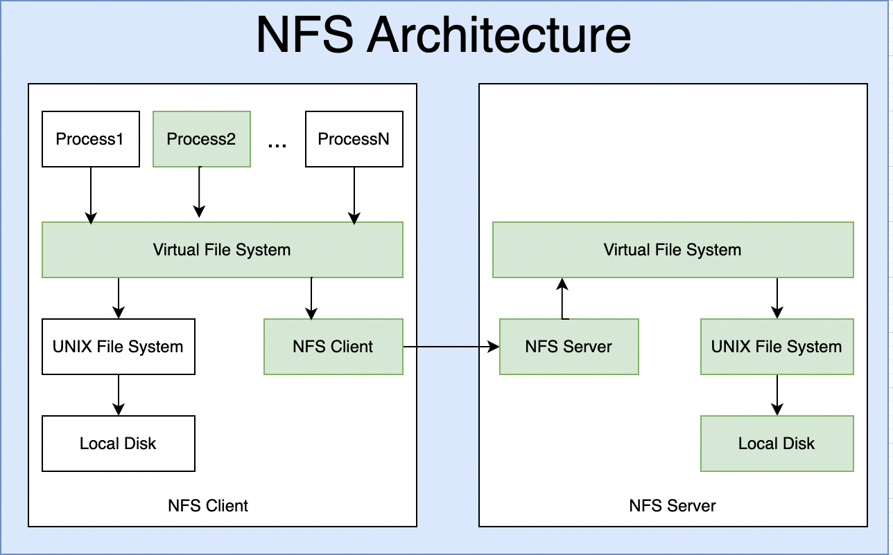

## NFS4 Grundlagen


**NFSv4 (Network File System Version 4)** ist ein Netzwerk-Dateisystem, mit dem Clients Dateien so nutzen können, als lägen sie lokal auf ihrem Rechner. Es ist besonders in **Linux- und Unix-Umgebungen** verbreitet und bringt gegenüber älteren Versionen (v2/v3) deutliche Verbesserungen bei **Sicherheit, Performance und Verwaltung.**

___

### 1. Grundprinzip

- Ein Server stellt Verzeichnisse (Exports) bereit.
- Ein Client bindet diese Verzeichnisse in sein lokales Dateisystem ein (Mount).
- Der Zugriff erfolgt transparent über das Netzwerk.

➡️ Für Anwendungen sieht es aus wie ein normales lokales Verzeichnis.
___

### 2. Wichtige Neuerungen von NFSv4

Im Vergleich zu NFSv3:

#### 🔹 Ein einziger Port
- NFSv4 nutzt nur TCP Port 2049
- Kein rpcbind, mountd oder statd mehr nötig
    → Einfachere Firewall- und Cloud-Konfiguration

#### 🔹 Stateful Protocol
- Der Server kennt den Zustand der Clients
- Ermöglicht File Locking direkt im Protokoll
- Bessere Fehlerbehandlung nach Verbindungsabbrüchen

#### 🔹 Integrierte Sicherheit
- Unterstützung von Kerberos (z. B. krb5, krb5i, krb5p)
- Optional: Authentifizierung, Integrität, Verschlüsselung
- Kein separates NFSv3-Locking mehr nötig

___

### 3. Rechte & ACLs

NFSv4 bringt ein eigenes **ACL-Modell**, das sich an Windows-ACLs orientiert:
- Feinere Rechte als klassische Unix-Rechte (rwx)
- Unterstützt User- und Gruppen-basierte Regeln
- Ideal für gemischte Linux-/Windows-Umgebungen

Beispiel:

```bash
A::user1:rwaDxtTnNcCy
D::user2:w
```

> ⚠️ Wichtig: UID/GID müssen zwischen Client und Server konsistent sein
> (z. B. über LDAP, FreeIPA oder manuell gepflegt)
___

### 4. Pseudofilesystem

Ein zentrales Konzept von NFSv4:
- Der Server präsentiert eine virtuelle Wurzel (/)
- Alle Exports liegen darunter
- Clients mounten immer relativ zu dieser NFS-Root

Beispiel:
```bash
mount server:/data/projekte /mnt/projekte
```
___

### 5. Typischer Einsatz

- Home-Verzeichnisse in Rechenzentren
- Shared Storage für Virtualisierung
- Cluster- und HPC-Umgebungen
- Ersatz für SMB in reinen Linux-Setups
___

### 6. Vorteile & Nachteile
#### ✅ Vorteile

- Weniger Dienste, einfacher Betrieb
- Bessere Sicherheit
- Sauberes Locking
- Firewall-freundlich

#### ❌ Nachteile

- Komplexere ACLs
- Stateful → Server-Neustarts müssen sauber gehandhabt werden
- Kerberos erfordert zusätzliche Infrastruktur

7. Abgrenzung: NFSv4 vs. NFSv3
Feature	NFSv3	NFSv4
Ports	Mehrere	Nur 2049
Locking	Extern	Integriert
Security	Schwach	Stark
ACLs	POSIX	NFSv4 ACLs
Stateful	Nein	Ja
